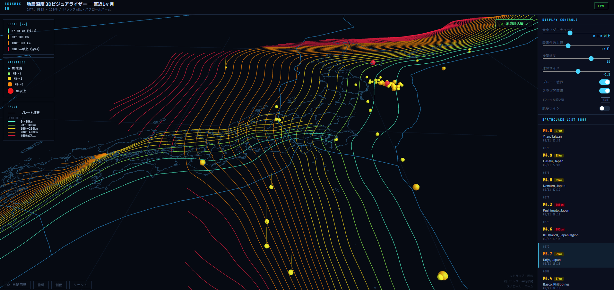
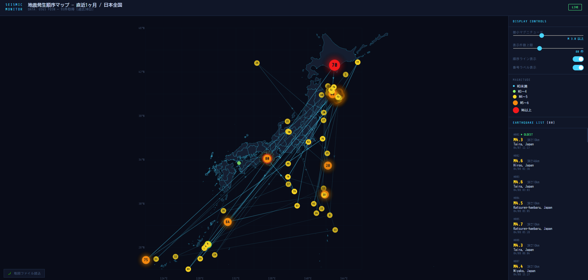

# 地震深度 3Dビジュアライザー

日本の地震・プレート構造を3Dで可視化するWebアプリです。

**3D版**: https://sobu-lab.github.io/earthquake/
**2D版**: https://sobu-lab.github.io/earthquake/earthquake_2d.html

## スクリーンショット

### 3D版

### 2D版

## 機能

- 過去30日のM3以上の地震をリアルタイム取得・3D表示
- 震源深さをZ軸で表現（地表から最大700km）
- 日本地図・プレート境界・スラブ等深線の重ね合わせ
- マグニチュードによる色分け
- 発生順序ライン（古→新）

## 操作方法

| 操作 | 動作 |
|---|---|
| 左ドラッグ | 回転 |
| 右ドラッグ | 平行移動 |
| スクロール | ズーム |
| ホバー | 地震情報表示 |

## Data sources

- Earthquake data: [USGS FDSN API](https://earthquake.usgs.gov/fdsnws/event/1/) (Public Domain)
- Japan map: [dataofjapan/land](https://github.com/dataofjapan/land) (MIT)
- Plate boundaries: [fraxen/tectonicplates](https://github.com/fraxen/tectonicplates) (CC BY 3.0)
- Slab geometry: [USGS Slab2](https://www.sciencebase.gov/catalog/item/5aa1b00ee4b0b1c392e86467) — Hayes et al. (2018) (CC0)
